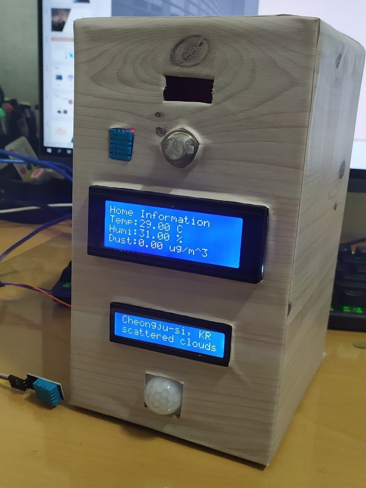
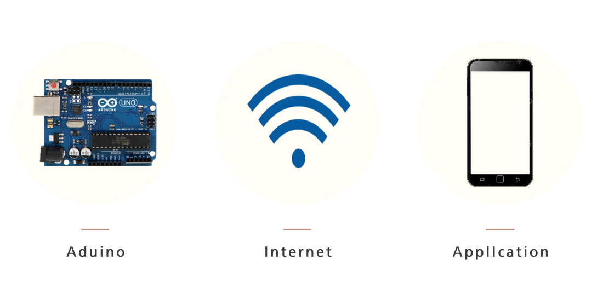
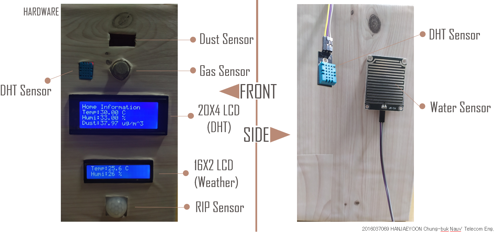
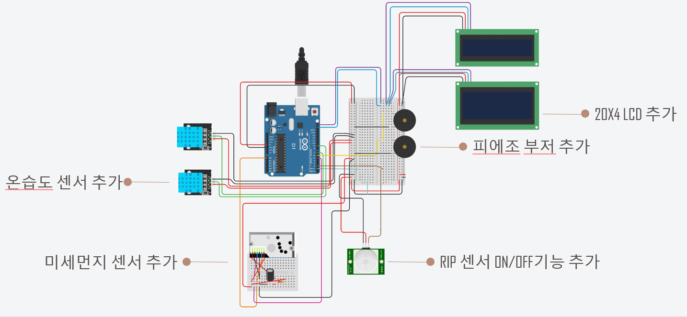
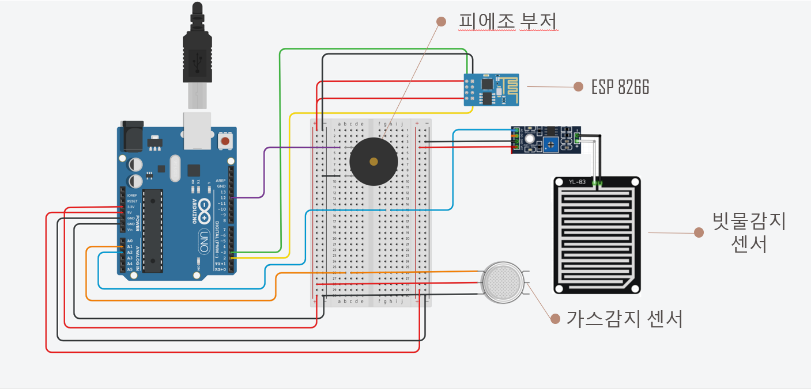
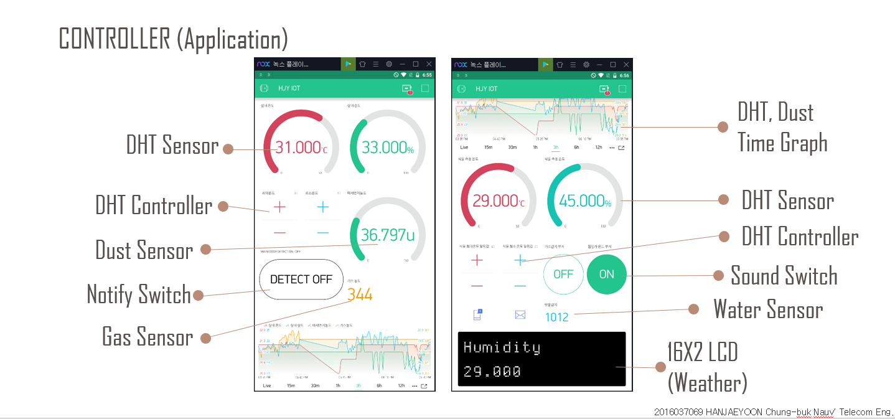

# Home IoT with Blynk

## 개요  
    미래설계2, 오픈소스전문프로젝트 과목에서 수행한 Term-project입니다.
    Wifi 통신으로 아두이노에서 습득한 데이터를 Blynk Application에 원하는 정보를 출력합니다. 

## Motivation  
    L사의 Home IoT제품군, S사의 인공지능서비스 N제품에 영감을 받았으며,  
    집안 내부의 정보를 습득하여 사용자에게 한눈에 알아보기 쉽게 편의성을 증대할 목적으로 구성하였습니다.
  
## 진행기간  
    1차: 2019.09.02 ~ 2019.11.25  
    2차: 2020.03.15 ~ 2020.06.06  
    약 5개월(169일) 진행  
  
## 기능(Features)
  1. 온,습도 감지 
  2. 미세먼지 감지
  3. 1,2 항목 디스플레이 출력
  4. 날씨 항목, 미세먼지 농도 예보 디스플레이 출력
  5. 침입자 감지
  6. 가스 누출 감지
  7. 빗물 감지
  8. 모든 기능 Blynk App에서 정보 출력 및 부분기능 조절가능
  
## HW - Preview

  
### - Auduino D1 R1   

  
### - Auduino UNO  

  

## SW
### - Application: Blynk

  
### - IDE: Arduino sketch 1.8.10

## Library
    다음과 같은 라이브러리를 사용하였으며, 현재 Repo에 포함하지 않음  

- Adafruit_Sensor  
    센서의 측정단위 표준화 및 기존 시스템과 호환성을 통한 데이터 로깅 및 데이터 전송에 유용한 라이브러리  
    Library Link: https://github.com/adafruit/Adafruit_Sensor  

- ArduinoJson-master
    Open API로 원하는 정보를 필터링하여 받아올 수 있게 할 수 있는 라이브러리. 대부분의 아두이노 기기에 사용될 수 있으며, 모든 Cpp을 사용하는 프로젝트에 사용할 수 있음  
    Library Link: https://github.com/bblanchon/ArduinoJson  

- Blynk-library
    Blynk App과 아두이노 WIFI(ESP8266)방식으로 통신을 지원하는 라이브러리  
    Library Link: https://github.com/blynkkk/blynk-library  

- DHT
    온습도센서(DHT11)에서 측정한 데이터를 아두이노 보드에서 수집 할 수 있는 라이브러리  
    Library Link: https://github.com/adafruit/DHT-sensor-library  

- LiquidCrystal_I2C
    I2C통신을 하는 LCD와 아두이노를 연결하기 위한 라이브러리  
    Library Link: https://github.com/johnrickman/LiquidCrystal_I2C

- SimpleTimer-master
    주기적 반복실행, 원하는 횟수만큼 실행 등 을 할 수 있으며 OPEN API에서 받는 정보 주기를 설정하기 위하여 사용한 라이브러리  
    Library Link: https://github.com/schinken/SimpleTimer  
    Official Document Link: https://playground.arduino.cc/Code/SimpleTimer/

## Others
- Project PPT: https://drive.google.com/file/d/1vZsOKlj9ge8G2JPCa3JwVKbKN1TQloDd/view  
- Project presentation URL: https://drive.google.com/file/d/1Bl3jRpoz8XpIynxJ3EtUWGVJ3_MGpZSO/view?usp=sharing
